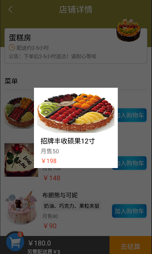
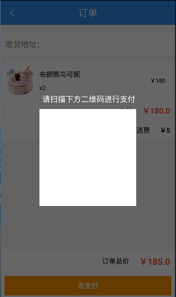

# Order-a-meal
## 一、项目概述
订餐项目是一个类似外卖的项目，包括订餐餐的店铺、各店铺的菜单、购物车以及订单与付款等模块。在店铺列表中可以看到店铺的名称、月销售、起送价格与支付、支付费用时间以及福利等信息，点击店铺列表中的任意一个店铺，进入刀店铺详情界面，该界面主要是显示店铺中的菜单，同时可以将想要吃的菜添加到购物车中，选完菜之后可以点击该界面中的“去结算”按钮，进入订单界面，在该界面对以点的菜单信息，并通过“去支付”按钮进行付款。
## 二、实现效果  
### 店铺界面  
    

### 店铺详情界面1  
    
 

### 菜品详情界面
    

### 店铺详情界面2  
    
  
  
  
### 店铺详情界面3  
    

### 确认清空购物车对话框  
     
  
   
### 订单界面 
    

### 支付界面 
    
